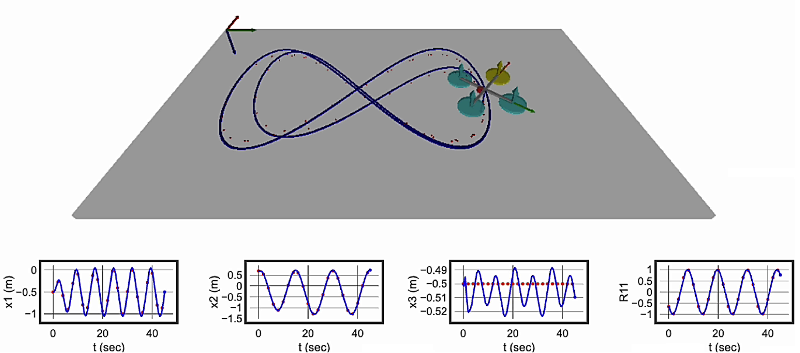
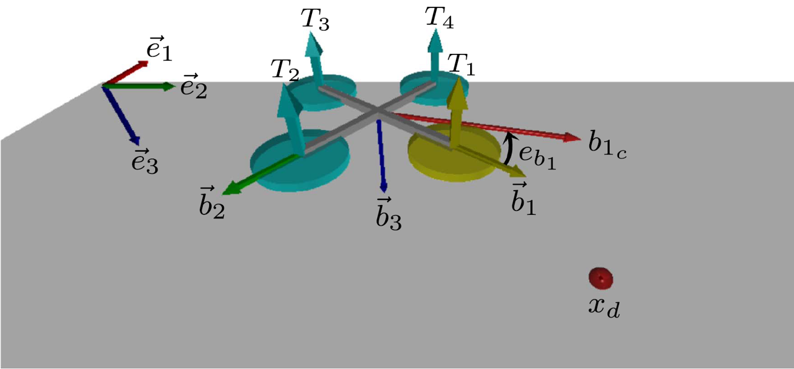
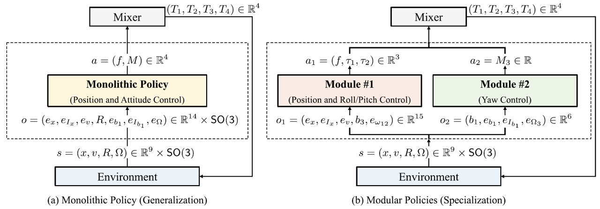
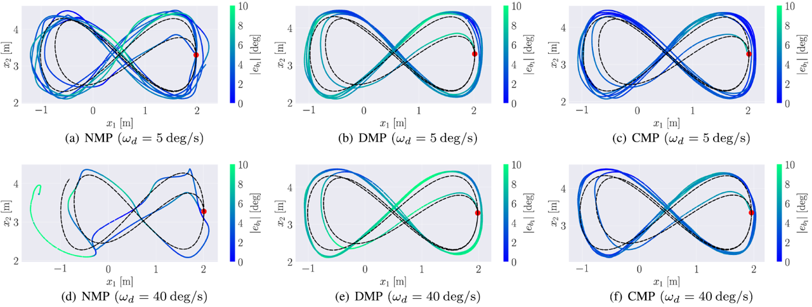

# gym-rotor-modularRL

### ***Unlocking the Potential of Modular Reinforcement Learning***

OpenAI Gym environments for quadrotor UAV control.
This repository implements both **monolithic** and **modular** reinforcement learning (RL) frameworks for the low-level control of a quadrotor unmanned aerial vehicle.
A detailed explanation of these concepts can be found in [this YouTube video](https://www.youtube.com/watch?v=-NQ6oRsdWgI).
To better understand **What Deep RL Do**, see [OpenAI Spinning UP](https://spinningup.openai.com/en/latest/index.html).



## Installation
### Requirements
The repository is compatible with Python 3.11.3, Gymnasium 0.28.1, Pytorch 2.0.1, and Numpy 1.25.1.
It is recommended to create [Anaconda](https://www.anaconda.com/) environment with Python 3 ([installation guide](https://docs.anaconda.com/anaconda/install/)).
Additionally, [Visual Studio Code](https://code.visualstudio.com/) is recommended for efficient code editing.

1. Open your ``Anaconda Prompt`` and install major packages.
```bash
conda install -c conda-forge gymnasium
conda install pytorch torchvision torchaudio pytorch-cuda=11.8 -c pytorch -c nvidia
conda install -c anaconda numpy
conda install -c conda-forge vpython
```
> Refer to the official documentation for [Gymnasium](https://anaconda.org/conda-forge/gymnasium), [Pytorch](https://pytorch.org/get-started/locally/), and [Numpy](https://anaconda.org/anaconda/numpy), and [Vpython](https://anaconda.org/conda-forge/vpython).

2. Clone the repository.
```bash
git clone https://github.com/fdcl-gwu/gym-rotor-modularRL.git
```

## Environments
### Quadrotor Dynamics 
Consider a quadrotor UAV below,



The position and the velocity of the quadrotor are represented by $x \in \mathbb{R}^3$ and $v \in \mathbb{R}^3$, respectively.
The attitude is defined by the rotation matrix $R \in SO(3) = \lbrace R \in \mathbb{R}^{3\times 3} | R^T R=I_{3\times 3}, \mathrm{det}[R]=1 \rbrace$, that is the linear transformation of the representation of a vector from the body-fixed frame $\lbrace \vec b_{1},\vec b_{2},\vec b_{3} \rbrace$ to the inertial frame $\lbrace \vec e_1,\vec e_2,\vec e_3 \rbrace$. 
The angular velocity vector is denoted by $\Omega \in \mathbb{R}^3$.
Given the total thrust $f = \sum{}_{i=1}^{4} T_i \in \mathbb{R}$ and the moment $M = [M_1, M_2, M_3]^T \in \mathbb{R}^3$ resolved in the body-fixed frame, the thrust of each motor $(T_1,T_2,T_3,T_4)$ is determined by

$$ \begin{gather} 
    \begin{bmatrix} 
        T_1 \\\ T_2 \\\ T_3 \\\ T_4
    \end{bmatrix}
    = \frac{1}{4}
    \begin{bmatrix}
        1 & 0      & 2/d   & -1/c_{\tau f} \\
        1 & -2/d & 0      & 1/c_{\tau f} \\
        1 & 0      & -2/d & -1/c_{\tau f} \\
        1 & 2/d   & 0      & 1/c_{\tau f} 
    \end{bmatrix}
    \begin{bmatrix}
        f \\\ M_1 \\\ M_2 \\\ M_3 
    \end{bmatrix}.
\end{gather} $$

### Training Frameworks
Two major training frameworks are provided for quadrotor low-level control tasks: (a) In a monolithic setting, a large end-to-end policy directly outputs total thrust and moments; (b) In modular frameworks, two modules collaborate to control the quadrotor: Module #1 and Module #2 specialize in translational control and yaw control, respectively. 

<p align="center">
    
</p>

| Env IDs | Description |
| :---: | --- |
| `Quad-v0` | This serves as the foundational environment for wrappers, where the state and action are represented as $s = (x, v, R, \Omega)$ and $a = (T_1, T_2, T_3, T_4)$.|
| `CoupledWrapper` | Wrapper for monolithic RL framework: the observation and action are given by $o = (e_x, e_{I_x}, e_v, R, e_{b_1}, e_{I_{b_1}}, e_\Omega)$ and $a = (f, M_1, M_2, M_3)$.|
| `DecoupledWrapper` | Wrapper for modular RL schemes: the observation and action for each agent are defined as $o_1 = (e_x, e_{I_x}, e_v, b_3, e_{\omega_{12}})$, $a_1 = (f, \tau)$ and $o_2 = (b_1, e_{b_1}, e_{I_{b_1}}, e_{\Omega_3})$, $a_2 = M_3$, respectively.|

where the error terms $e_x, e_v$, and $e_\Omega$ represent the errors in position, velocity, and angular velocity, respectively.
Also, we introduced the integral terms $e_{I_x}$ and $e_{I_{b_1}}$ to eliminate steady-state errors.
More details are available in [our publication](https://ieeexplore.ieee.org/document/10777540).

## Examples
There are three training frameworks for quadrotor control: NMP (Non-modular **Monolithic** Policy), DMP (**Decentralized Modular** Policies), and CMP (**Centralized Modular** Policies).
Note that our study investigates two inter-module communication strategies to optimize coordination across modules: centralized and decentralized coordination. 
In the decentralized setting, namely DMP, modules independently learn their action value functions and policies without inter-agent synchronization.
In contrast, centralized methods, called CMP, introduce centralized critic networks to share information between modules during training.
You can adjust the hyperparameters in `args_parse.py` to fine-tune the models.

### Training 
To train the agent with different frameworks, use the following commands,
```bash
# Non-modular monolithic framework
python3 main.py --framework NMP 
# Centralized modular framework
python3 main.py --framework CMP 
# Decentralized modular framework
python3 main.py --framework DMP 
```

### Testing
The trained model is saved in the `models` folder (e.g. `NMP_632.0k_steps_agent_0_789`).
First, modify `total_steps` value in `main.py`, for example, for NMP schemes,
```bash
        # Load trained models for evaluation:
        if self.args.eval_model:
            if self.framework == "NMP":
                total_steps, agent_id = 632_000, 0  # edit 'total_steps' accordingly
                self.agent_n[agent_id].load(self.framework, total_steps, agent_id, self.seed)
```
Next, run the following command,
```bash
python3 main.py --framework NMP --eval_model True --save_log True --render True --seed 789
```

### Plotting Results
When testing the trained models, we can save the flight data using the `--save_log True` flag.
Then the data is saved to the `results` folder along with the current date and time (e.g. `NMP_log_20250114_163953.dat`).
To visualize the flight data, open `draw_plot.py` and update the `file_name` accordingly, e.g., `file_name = 'NMP_log_20250114_163953'`.
Lastly, run the plotting script,
```bash
python3 draw_plot.py --framework NMP
```

## Results
At slower desired yaw rates, such as $\omega_d = 5$ deg/s, all three frameworks demonstrate satisfactory accuracy in position tracking and heading control. 
However, as $\omega_d$ is increased, the performance of NMP degrades.
In contrast, both CMP and DMP exhibit superior performance thanks to their modular structure, as changes in one module do not affect the other, thereby enhancing robustness and fault tolerance. 



## Citation
If you find this work useful in your work and would like to cite it, please give credit to our work:
```bash
@article{yu2024modular,
  title={Modular Reinforcement Learning for a Quadrotor UAV with Decoupled Yaw Control},
  author={Yu, Beomyeol and Lee, Taeyoung},
  journal={IEEE Robotics and Automation Letters},
  year={2024},
  publisher={IEEE}}

@inproceedings{yu2024multi,
  title={Multi-Agent Reinforcement Learning for the Low-Level Control of a Quadrotor UAV},
  author={Yu, Beomyeol and Lee, Taeyoung},
  booktitle={2024 American Control Conference (ACC)},
  pages={1537--1542},
  year={2024},
  organization={IEEE}}
```

## Reference:
- https://github.com/ethz-asl/reinmav-gym
- https://github.com/Lizhi-sjtu/MARL-code-pytorch
